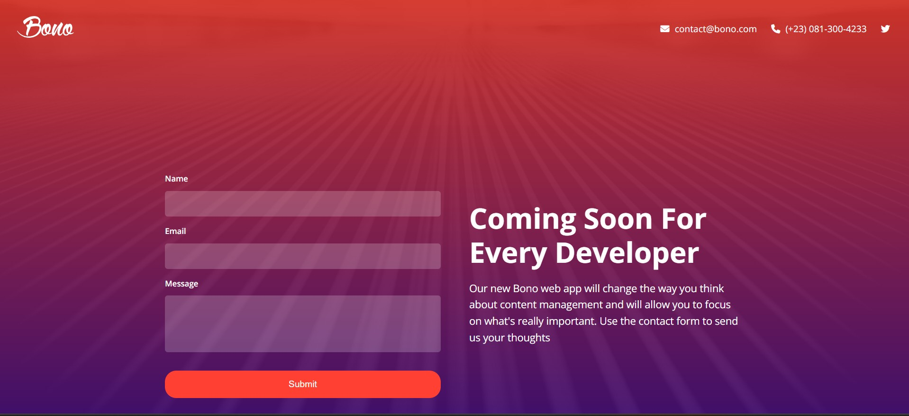

# Bono – Landing Page

A responsive coming-soon / signup landing page built with HTML and CSS.

## Preview



## Project Link

Check it out live: [https://bonoappsignup.netlify.app/](https://bonoappsignup.netlify.app/)

## Overview

**Bono** is a simple product landing page designed to collect early signups and inform users that a product is coming soon.  
This project focuses on layout structure, clean UI, and responsive design across devices.

## Features

- Hero section with branding and messaging
- Coming-soon text with call to action
- Signup form (name, email, message)
- Fully responsive layout (mobile, tablet, desktop)
- Clean and simple UI

## Built With

- HTML5
- CSS3 (Flexbox & Media Queries)

## Responsiveness

The layout adapts to:

- Desktop screens
- Tablets
- Mobile devices

Using a mobile-first approach and media queries.

## Project Structure

```text
bono-landing-page/
├── images/
├── css/
│   └── style.css
└── index.html
```
